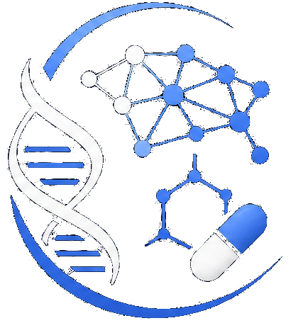

::: {.hero}

{.hero-logo fig-alt="GMTD 2026 logo"}

# Generative Models for Therapeutic Discovery 2026

## Learning molecules, targets and cell-state responses

**University of Cambridge · Computer Laboratory**  
**29–30 September 2026**  
**Cambridge, United Kingdom**

[Register interest](registration.qmd){.btn .btn-primary .btn-lg} [View programme](programme.qmd){.btn .btn-outline-light .btn-lg}

:::

::: {.container-narrow}

## About the workshop

Recent advances in generative artificial intelligence are reshaping therapeutic discovery, moving beyond the design of individual molecules toward models that can connect chemical structure, biological targets, disease mechanisms and cellular responses. At the same time, the rapid growth of high-dimensional biomedical data — including multi-omics, perturbation screens, single-cell profiling, imaging and clinical datasets — creates new opportunities to learn representations of biological systems that are both predictive and mechanistically informative.

This workshop will bring together researchers working at the interface of machine learning, computational biology and drug discovery to discuss how generative and relational models can support the discovery of new therapeutic hypotheses. Topics will include molecular generation, target identification, perturbation-response modelling, cell-state prediction, multimodal data integration, foundation models for biology, and evaluation strategies for biomedical generative systems.

A central theme of the workshop is the shift from generating candidate molecules in isolation to learning structured relationships between molecules, targets, pathways, cell states and disease contexts. By connecting these levels, generative models may help prioritize interventions, predict therapeutic effects, and reveal mechanisms underlying treatment response. The workshop aims to foster discussion on methodological advances, practical applications and open challenges in building reliable, interpretable and biologically grounded models for therapeutic discovery.

## Topics

::: {.topic-grid}

::: {.topic-card}
**Molecular generation**  
Generative models for molecular design, optimization and prioritization.
:::

::: {.topic-card}
**Targets and mechanisms**  
Learning relationships between targets, pathways, disease states and therapeutic hypotheses.
:::

::: {.topic-card}
**Cell-state responses**  
Perturbation-response modelling, single-cell profiles and cellular state prediction.
:::

::: {.topic-card}
**Multimodal biomedical data**  
Multi-omics, imaging, clinical data and foundation models for biology.
:::

::: {.topic-card}
**Evaluation and validation**  
Benchmarking, interpretability, biological grounding and reproducibility.
:::

::: {.topic-card}
**Relational modelling**  
Structured models connecting molecules, targets, cells, pathways and patients.
:::

:::

## Key information

| Item | Details |
|---|---|
| **Dates** | 29–30 September 2026 |
| **Location** | University of Cambridge, Computer Laboratory |
| **Format** | Two-day in-person workshop |
| **Registration** | Opening soon |
| **Speakers** | To be announced |

:::

::: {.organiser-grid .organiser-grid-compact}

::: {.organiser-card .compact}
[{.organiser-photo fig-alt="Pietro Liò"}](https://www.cl.cam.ac.uk/~pl219/){target="_blank"}

### [Prof. Pietro Liò](https://www.cl.cam.ac.uk/~pl219/){target="_blank"}

**University of Cambridge, Cambridge, UK**
:::

::: {.organiser-card .compact}
[{.organiser-photo fig-alt="Dario Righelli"}](https://www.github.com/drighelli){target="_blank"}

### [Dr. Dario Righelli](https://www.github.com/drighelli){target="_blank"}

**University of Cambridge, Cambridge, UK**  
**University of Padova, Padua, Italy**
:::

::: {.organiser-card .compact}
[{.organiser-photo fig-alt="Cristian Taccioli"}](https://tacclab.org/){target="_blank"}

### [Prof. Cristian Taccioli](https://tacclab.org/){target="_blank"}

**University of Cambridge, Cambridge, UK**  
**University of Padova, Padua, Italy**
:::

:::