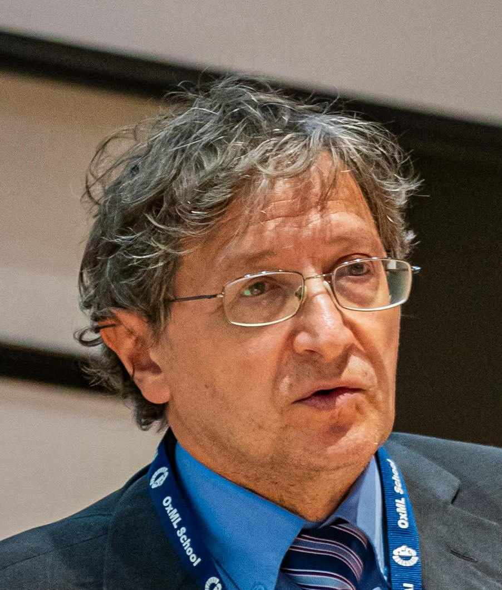
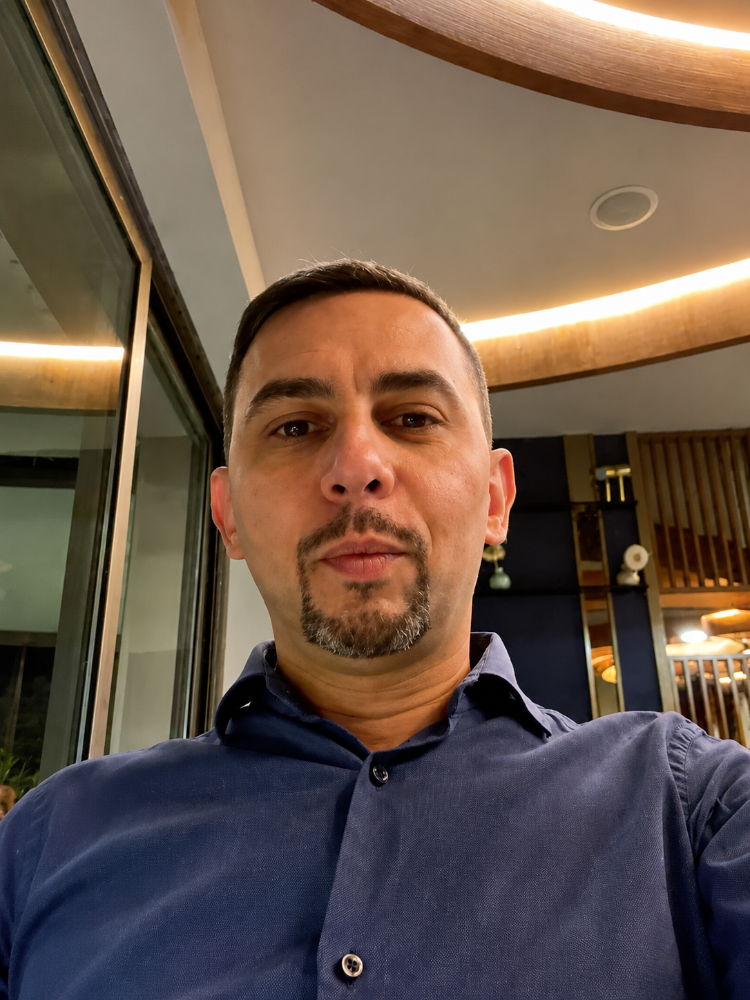
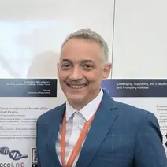

## Organising committee

::: {.organiser-grid}

::: {.organiser-card}
[{.organiser-photo fig-alt="Pietro Liò"}](https://www.cl.cam.ac.uk/~pl219/){target="_blank"}

### [Prof. Pietro Liò](https://www.cl.cam.ac.uk/~pl219/){target="_blank"}

**University of Cambridge, Cambridge, UK**

Pietro Liò is Professor at the Department of Computer Science and Technology, University of Cambridge, where he is a member of the Artificial Intelligence group. He is also a member of the Cambridge Centre for AI in Medicine. His research focuses on computational models for biomedical data, including graph-based learning, multi-omics integration, disease modelling and precision medicine.
:::

::: {.organiser-card}
[{.organiser-photo fig-alt="Dario Righelli"}](https://www.github.com/drighelli){target="_blank"}

### [Dr. Dario Righelli](https://www.github.com/drighelli){target="_blank"}

**University of Cambridge, Cambridge, UK**  
**University of Padova, Padua, Italy**

Dario Righelli is a Tenure Track Assistant Professor at the University of Padova and a Visiting Researcher at the University of Cambridge. His work focuses on computational methods for single-cell, spatial and multimodal omics data, with interests in biological network modelling, representation learning and reproducible software for biomedical data analysis.
:::

::: {.organiser-card}
[{.organiser-photo fig-alt="Cristian Taccioli"}](https://tacclab.org/){target="_blank"}

### [Prof. Cristian Taccioli](https://tacclab.org/){target="_blank"}

**University of Cambridge, Cambridge, UK**  
**University of Padova, Padua, Italy**

Cristian Taccioli is Associate Professor at the University of Padova and Visiting Professor at the University of Cambridge. His research lies at the interface of computational biology, molecular biology and biomedical research, focusing on high-dimensional biological data and molecular mechanisms relevant to disease.
:::

:::