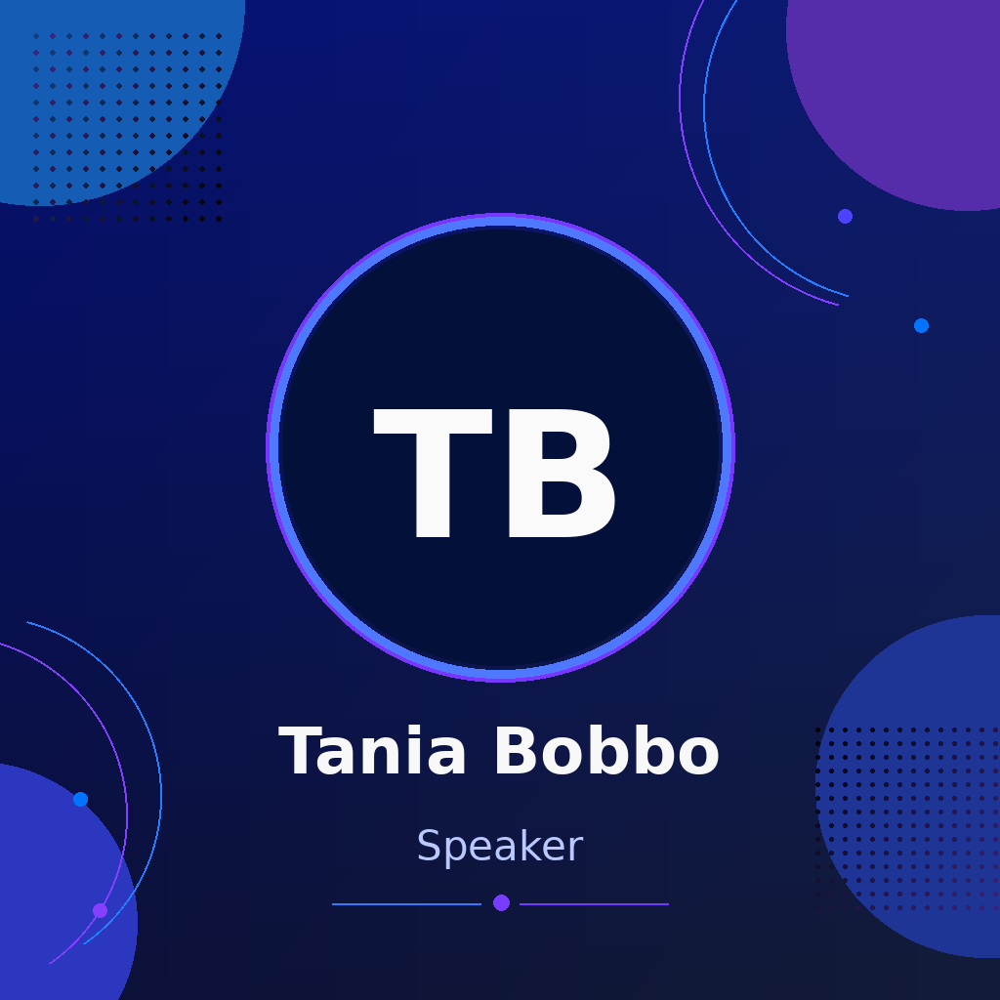
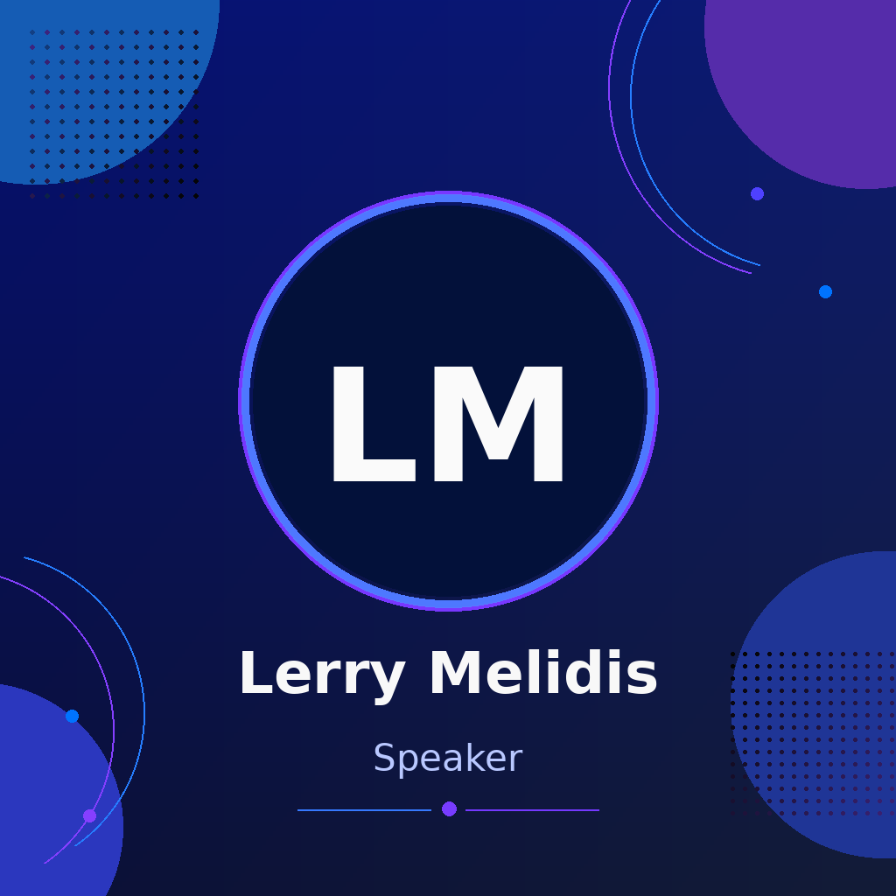
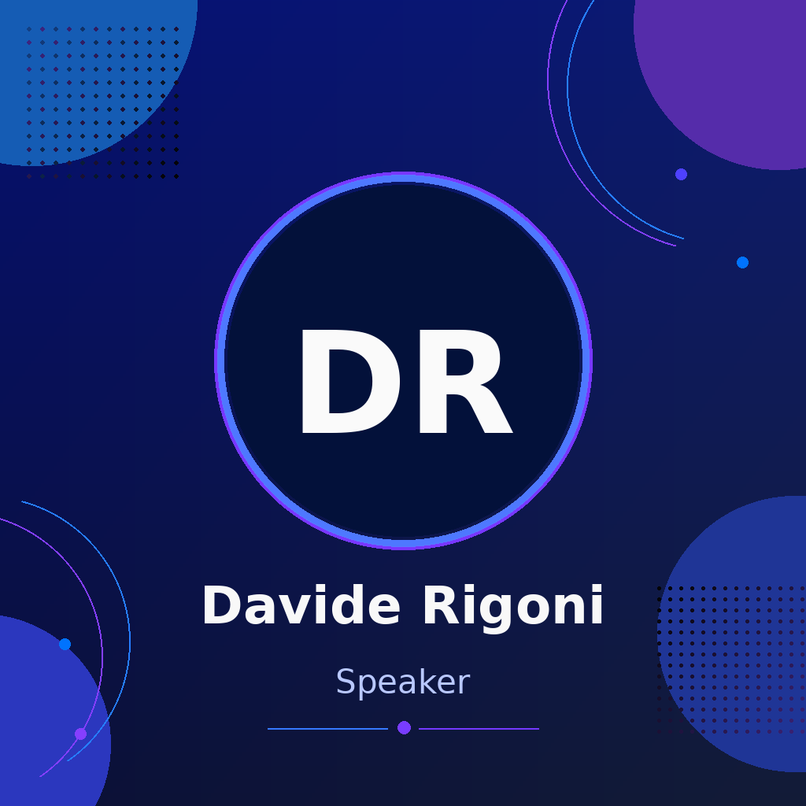

::: {.speaker-gallery}

::: {.speaker-profile}
[{.speaker-profile-photo fig-alt="Ilaria Billato"}](){target="_blank"}

### [Dr. Ilaria Billato](){target="_blank"}

PostDoc at  
University of Padova, Dept. of Biology
:::

::: {.speaker-profile}
[{.speaker-profile-photo fig-alt="Tania Bobbo"}](){target="_blank"}

### [Dr. Tania Bobbo](){target="_blank"}

CNR Researcher at  
CNR IBBA Milano
:::

::: {.speaker-profile}
[{.speaker-profile-photo fig-alt="Dr. Alessandro Bonetti"}](https://www.linkedin.com/in/alessandro-bonetti-087745a/){target="_blank"}

### [Dr. Alessandro Bonetti](https://www.linkedin.com/in/alessandro-bonetti-087745a/){target="_blank"}

Director at  
AstraZeneca
:::

::: {.speaker-profile}
[{.speaker-profile-photo fig-alt="Dr. Gabriele Corso"}](https://gcorso.github.io/){target="_blank"}

### [Dr. Gabriele Corso](https://gcorso.github.io/){target="_blank"}

Co-founder and CEO at  
Boltz
:::

::: {.speaker-profile}
[{.speaker-profile-photo fig-alt="Dr. Tiansi Dong"}](https://tiansidr.github.io/){target="_blank"}

### [Dr. Tiansi Dong](https://tiansidr.github.io/){target="_blank"}

Research Scientist at  
Alan Turing Institute
:::

::: {.speaker-profile}
[{.speaker-profile-photo fig-alt="Dr. Fabian Frohlich"}](https://www.crick.ac.uk/research/labs/fabian-frohlich){target="_blank"}

### [Dr. Fabian Frohlich](https://www.crick.ac.uk/research/labs/fabian-frohlich){target="_blank"}

Group Leader at  
The Francis Crick Institute
:::

::: {.speaker-profile}
[{.speaker-profile-photo fig-alt="Dr. Johann Hawe"}](){target="_blank"}

### [Dr. Johann Hawe](){target="_blank"}

AI Engineer at  
Illumina - Artificial Intelligence Lab
:::

::: {.speaker-profile}
[{.speaker-profile-photo fig-alt="Dr. Mikhail Kabeshov"}](){target="_blank"}

### [Dr. Mikhail Kabeshov](){target="_blank"}

Project Leader at  
AstraZeneca
:::

::: {.speaker-profile}
[{.speaker-profile-photo fig-alt="Dr. Anurag Limdi"}](){target="_blank"}

### [Dr. Anurag Limdi](){target="_blank"}

ML Scientist at  
EMBL-EBI
:::

::: {.speaker-profile}
[{.speaker-profile-photo fig-alt="Prof. Michail Mamalakis"}](https://www.cst.cam.ac.uk/people/mm2703){target="_blank"}

### [Prof. Michail Mamalakis](https://www.cst.cam.ac.uk/people/mm2703){target="_blank"}

Assistant Research Professor at  
CRUK Cambridge Institute
:::

::: {.speaker-profile}
[{.speaker-profile-photo fig-alt="Lerry Melidis"}](){target="_blank"}

### [Dr. Lerry Melidis](){target="_blank"}

PostDoc at  
University of Cambridge, CRUK Cambridge Institute
:::

::: {.speaker-profile}
[{.speaker-profile-photo fig-alt="David Miller"}](){target="_blank"}

### [David Miller](){target="_blank"}

PhD Candidate at  
University College London
:::

::: {.speaker-profile}
[{.speaker-profile-photo fig-alt="Bianca Pierattini"}](https://www.linkedin.com/in/biancapierattini){target="_blank"}

### [Dr. Bianca Pierattini](https://www.linkedin.com/in/biancapierattini){target="_blank"}

PostDoc at  
University of Cambridge, Biochemistry Department
:::

::: {.speaker-profile}
[{.speaker-profile-photo fig-alt="Dr. Esther Wershof"}](https://www.linkedin.com/in/esther-wershof-585b35220/){target="_blank"}

### [Dr. Esther Wershof](https://www.linkedin.com/in/esther-wershof-585b35220/){target="_blank"}

Machine Learning Lead at  
Altos Labs
:::

:::

##

::: {.speaker-gallery}

::: {.speaker-profile}
[{.speaker-profile-photo fig-alt="Fabio Bove"}](){target="_blank"}

### [Fabio Bove](){target="_blank"}

PhD Student at  
University of Padova
:::

::: {.speaker-profile}
[{.speaker-profile-photo fig-alt="Irwin Christofer"}](){target="_blank"}

### [Irwin Christofer](){target="_blank"}

PhD Student at  
University of Cambridge, Dept. of Computer Science and Technology
:::

::: {.speaker-profile}
[{.speaker-profile-photo fig-alt="Massimiliano Coretti"}](){target="_blank"}

### [Massimiliano Coretti](){target="_blank"}

PhD Student at  
University of Cambridge, Dept. of Computer Science and Technology
:::

::: {.speaker-profile}
[{.speaker-profile-photo fig-alt="Andrea Giuseppe di Francesco"}](){target="_blank"}

### [Andrea Giuseppe di Francesco](){target="_blank"}

PhD Student at  
University of Cambridge, Dept. of Computer Science and Technology
:::

::: {.speaker-profile}
[{.speaker-profile-photo fig-alt="Davide Rigoni"}](){target="_blank"}

### [Davide Rigoni](){target="_blank"}

PhD Student at  
University of Padova
:::

::: {.speaker-profile}
[{.speaker-profile-photo fig-alt="Salvo Romano"}](){target="_blank"}

### [Salvo Romano](){target="_blank"}

PhD Student at  
University of Cambridge, Dept. of Computer Science and Technology
:::

::: {.speaker-profile}
[{.speaker-profile-photo fig-alt="Andrea Rubbi"}](){target="_blank"}

### [Andrea Rubbi](){target="_blank"}

PhD Student at  
University of Cambridge, Dept. of Computer Science and Technology
:::

::: {.speaker-profile}
[{.speaker-profile-photo fig-alt="Wageesha Widuranga"}](){target="_blank"}

### [Wageesha Widuranga](){target="_blank"}

PhD Student at  
University of Padova
:::

:::