::: {.speaker-gallery}

::: {.speaker-profile}
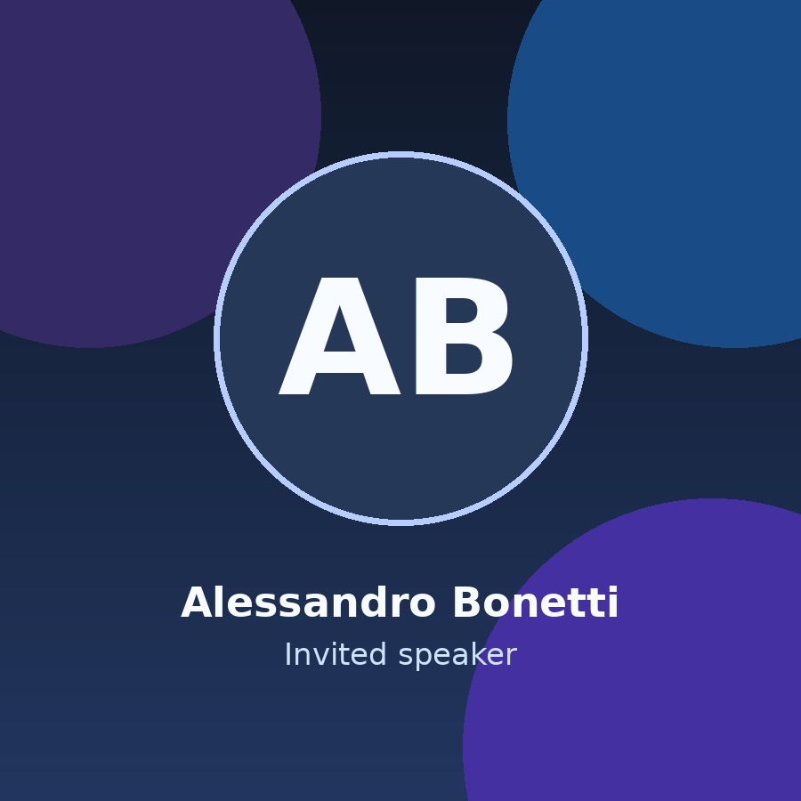{.speaker-profile-photo fig-alt="Dr. Alessandro Bonetti"}

### Dr. Alessandro Bonetti

Director at  
AstraZeneca
:::

::: {.speaker-profile}
[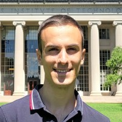{.speaker-profile-photo fig-alt="Dr. Gabriele Corso"}](https://gcorso.github.io/){target="_blank"}

### [Dr. Gabriele Corso](https://gcorso.github.io/){target="_blank"}

Co-founder and CEO at  
Boltz
:::

::: {.speaker-profile}
[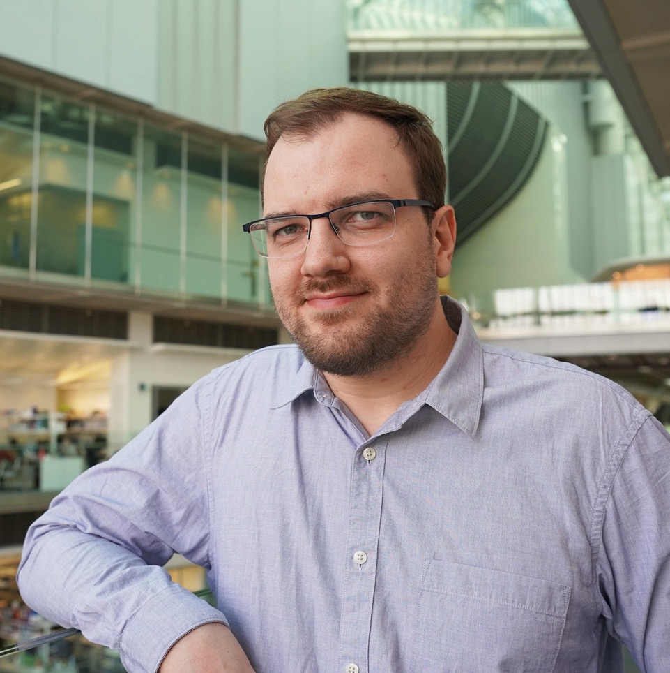{.speaker-profile-photo fig-alt="Dr. Fabian Frohlich"}](https://www.crick.ac.uk/research/labs/fabian-frohlich){target="_blank"}

### [Dr. Fabian Frohlich](https://www.crick.ac.uk/research/labs/fabian-frohlich){target="_blank"}

Group Leader at  
The Francis Crick Institute
:::

::: {.speaker-profile}
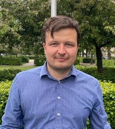{.speaker-profile-photo fig-alt="Dr. Mikhail Kabeshov"}

### Dr. Mikhail Kabeshov

Project Leader at  
AstraZeneca
:::

::: {.speaker-profile}
[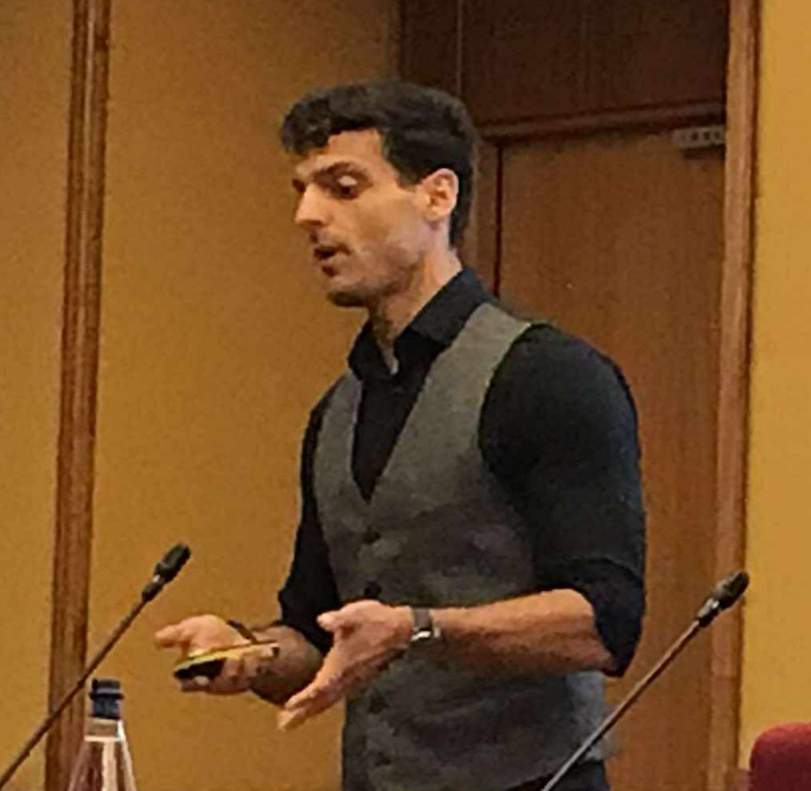{.speaker-profile-photo fig-alt="Prof. Michail Mamalakis"}](https://www.cst.cam.ac.uk/people/mm2703){target="_blank"}

### [Prof. Michail Mamalakis](https://www.cst.cam.ac.uk/people/mm2703){target="_blank"}

Assistant Research Professor at  
CRUK Cambridge Institute
:::

::: {.speaker-profile}
[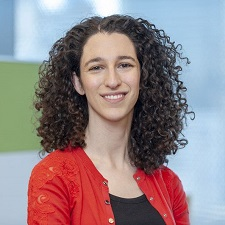{.speaker-profile-photo fig-alt="Dr. Esther Wershof"}](https://www.linkedin.com/in/esther-wershof-585b35220/){target="_blank"}

### [Dr. Esther Wershof](https://www.linkedin.com/in/esther-wershof-585b35220/){target="_blank"}

Machine Learning Lead at  
Altos Labs
:::

:::

## 

::: {.speaker-gallery}

::: {.speaker-profile}
[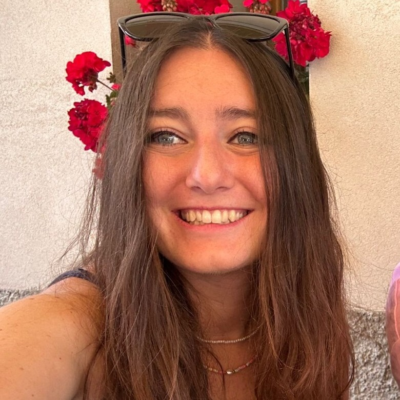{.speaker-profile-photo fig-alt="Ilaria Billato"}](https://github.com/billila){target="_blank"}

### [Dr. Ilaria Billato](https://github.com/billila){target="_blank"}

PostDoc at  
University of Padova, Dept. of Biology
:::

::: {.speaker-profile}
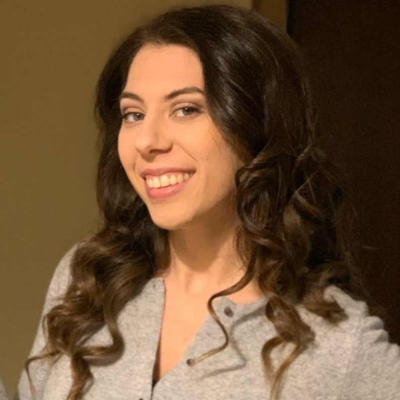{.speaker-profile-photo fig-alt="Tania Bobbo"}

### Dr. Tania Bobbo

CNR Researcher at  
CNR IBBA Milano
:::

::: {.speaker-profile}
[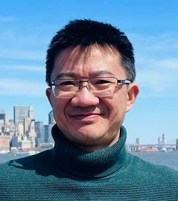{.speaker-profile-photo fig-alt="Dr. Tiansi Dong"}](https://tiansidr.github.io/){target="_blank"}

### [Dr. Tiansi Dong](https://tiansidr.github.io/){target="_blank"}

Research Scientist at  
Alan Turing Institute
:::

::: {.speaker-profile}
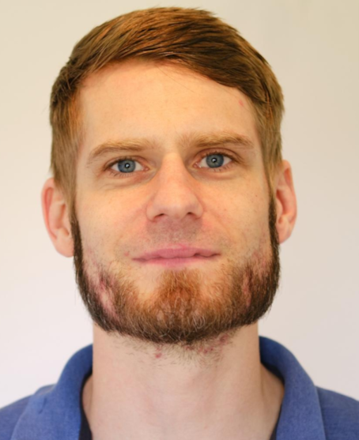{.speaker-profile-photo fig-alt="Dr. Johann Hawe"}

### Dr. Johann Hawe

AI Engineer at  
Illumina - Artificial Intelligence Lab
:::

::: {.speaker-profile}
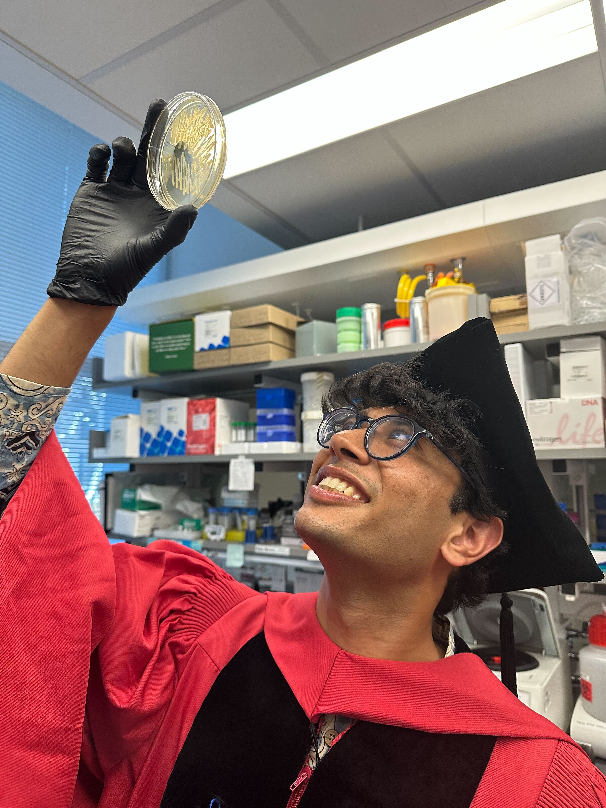{.speaker-profile-photo fig-alt="Dr. Anurag Limdi"}

### Dr. Anurag Limdi

ML Scientist at  
EMBL-EBI
:::

::: {.speaker-profile}
[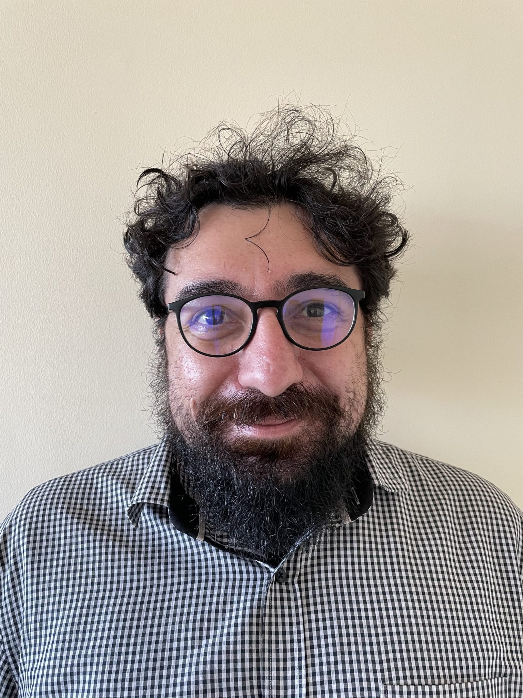{.speaker-profile-photo fig-alt="Lerry Melidis"}](https://orcid.org/0000-0001-6853-2722){target="_blank"}

### [Dr. Lerry Melidis](https://orcid.org/0000-0001-6853-2722){target="_blank"}

PostDoc at  
University of Cambridge, CRUK Cambridge Institute
:::

::: {.speaker-profile}
[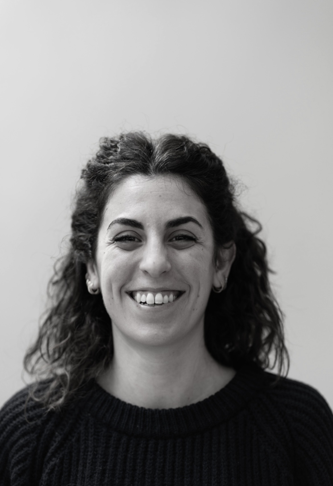{.speaker-profile-photo fig-alt="Bianca Pierattini"}](https://www.linkedin.com/in/biancapierattini){target="_blank"}

### [Dr. Bianca Pierattini](https://www.linkedin.com/in/biancapierattini){target="_blank"}

PostDoc at  
University of Cambridge, Biochemistry Department
:::

::: {.speaker-profile}
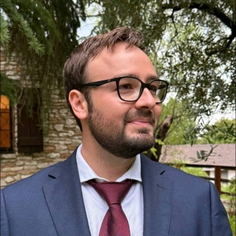{.speaker-profile-photo fig-alt="Davide Rigoni"}

### Davide Rigoni

PostDoc at  
University of Padova
:::

:::

##

::: {.speaker-gallery}

::: {.speaker-profile}
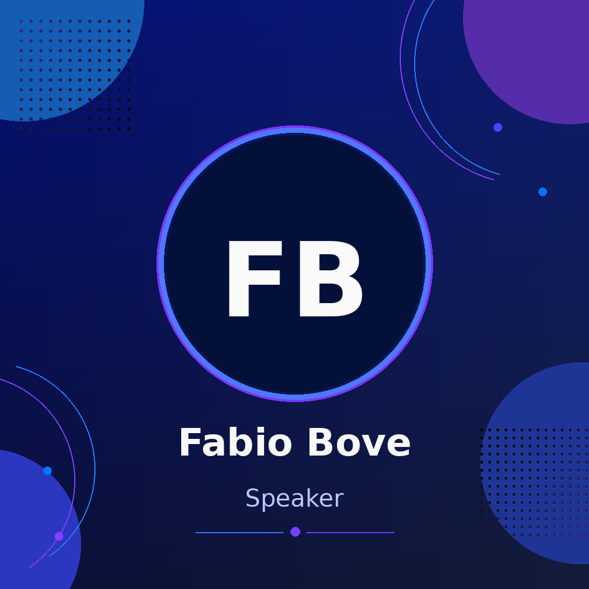{.speaker-profile-photo fig-alt="Fabio Bove"}

### Fabio Bove

PhD Student at  
University of Padova
:::

::: {.speaker-profile}
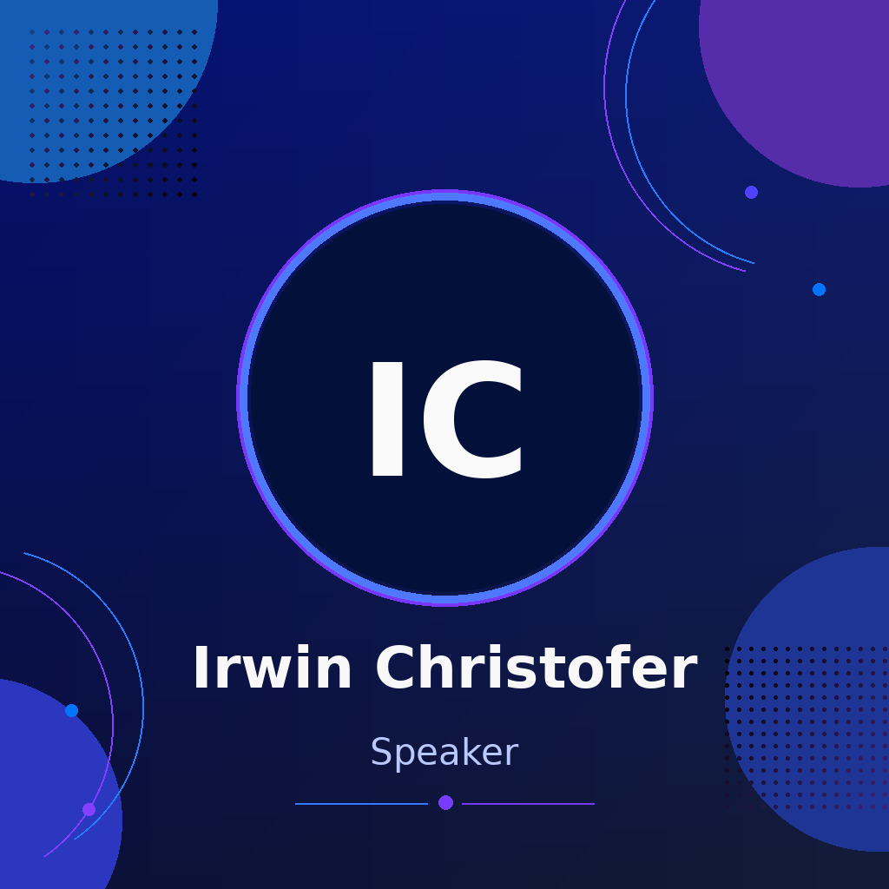{.speaker-profile-photo fig-alt="Irwin Christofer"}

### Irwin Christofer

PhD Student at  
University of Cambridge, Dept. of Computer Science and Technology
:::

::: {.speaker-profile}
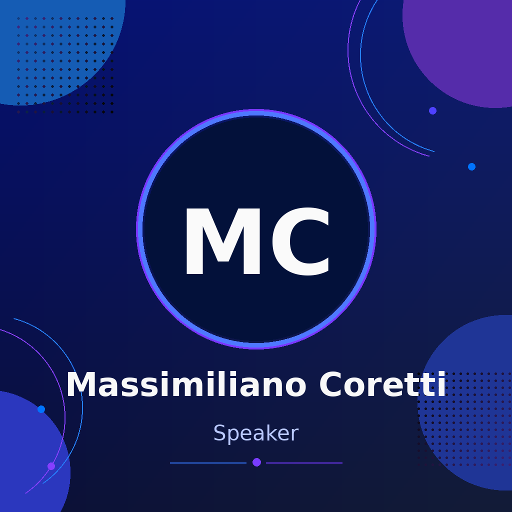{.speaker-profile-photo fig-alt="Massimiliano Coretti"}

### Massimiliano Coretti

PhD Student at  
University of Cambridge, Dept. of Computer Science and Technology
:::

::: {.speaker-profile}
[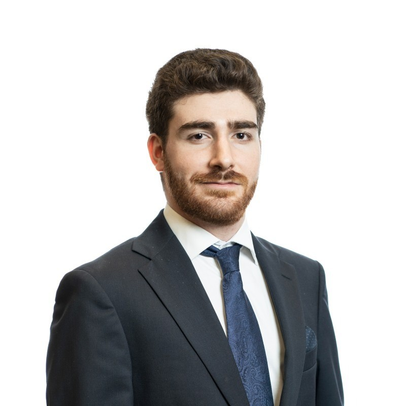{.speaker-profile-photo fig-alt="Andrea Giuseppe di Francesco"}](https://sites.google.com/uniroma1.it/andreagiuseppedifrancesco/home-page){target="_blank"}

### [Andrea Giuseppe di Francesco](https://sites.google.com/uniroma1.it/andreagiuseppedifrancesco/home-page){target="_blank"}

PhD Student at  
Sapienza University of Rome
:::

::: {.speaker-profile}
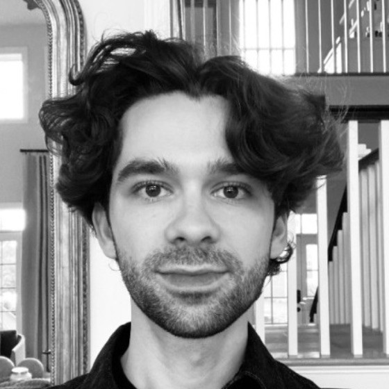{.speaker-profile-photo fig-alt="David Miller"}

### David Miller

PhD Candidate at  
University College London
:::

::: {.speaker-profile}
{.speaker-profile-photo fig-alt="Salvo Romano"}

### Salvo Romano

PhD Student at  
University of Catania
:::

::: {.speaker-profile}
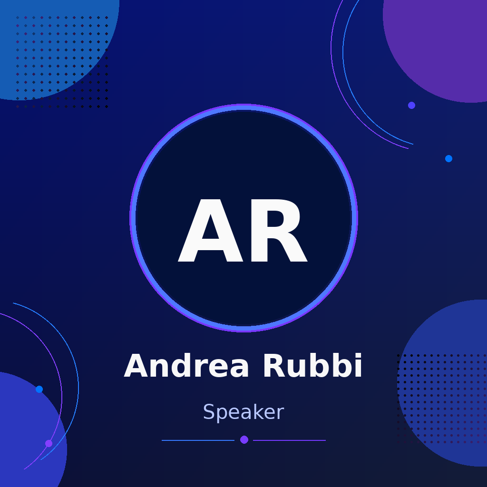{.speaker-profile-photo fig-alt="Andrea Rubbi"}

### Andrea Rubbi

PhD Student at  
University of Cambridge, Dept. of Computer Science and Technology
:::

::: {.speaker-profile}
{.speaker-profile-photo fig-alt="Wageesha Widuranga"}

### Wageesha Widuranga

PhD Student at  
University of Padova
:::

:::