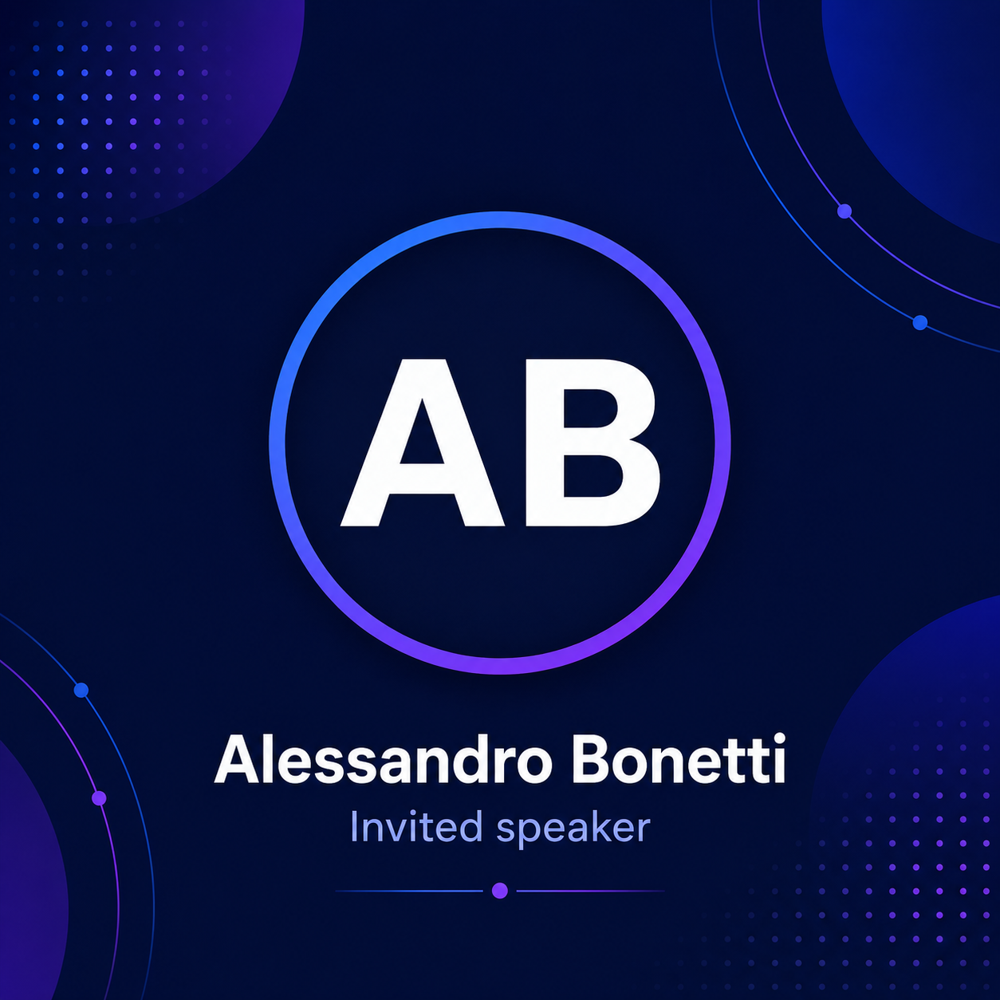
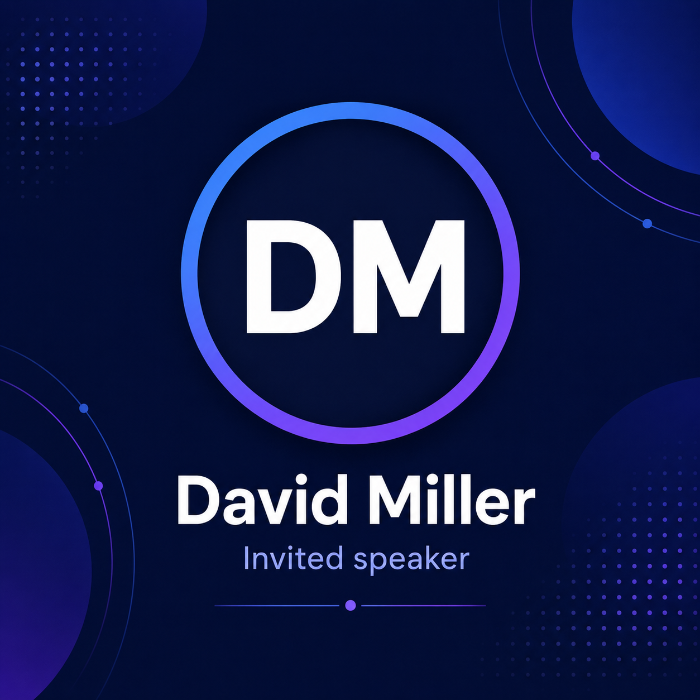
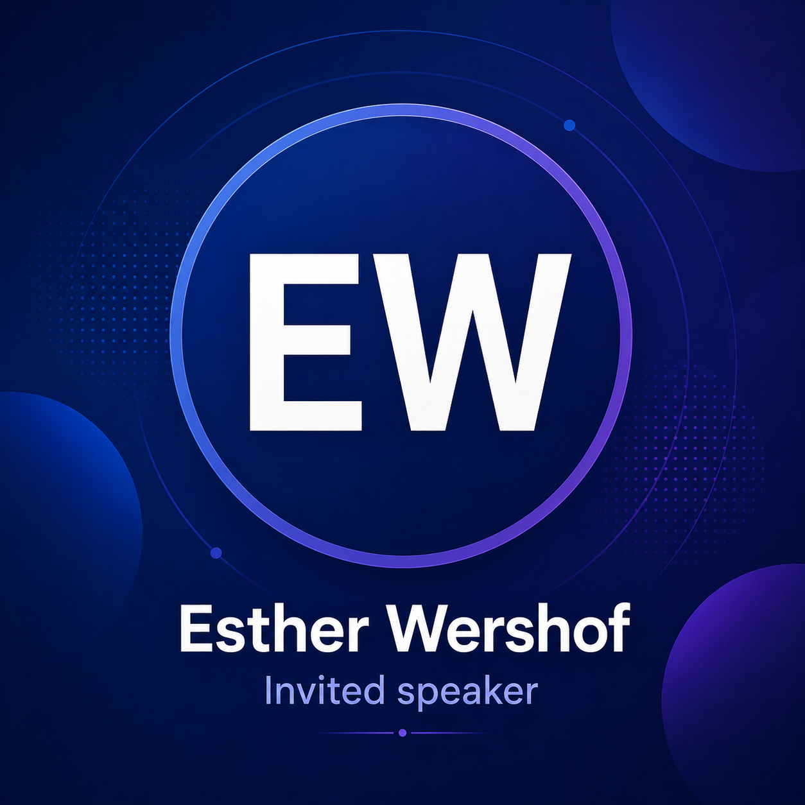

::: {.speaker-gallery}

::: {.speaker-profile}
[{.speaker-profile-photo fig-alt="Dr Alessandro Bonetti"}](https://www.linkedin.com/in/alessandro-bonetti-087745a/){target="_blank"}

### [Dr. Alessandro Bonetti](https://www.linkedin.com/in/alessandro-bonetti-087745a/){target="_blank"}

Director at  
AstraZeneca

:::

::: {.speaker-profile}
[{.speaker-profile-photo fig-alt="Dr Gabriele Corso"}](https://gcorso.github.io/){target="_blank"}

### [Dr. Gabriele Corso](https://gcorso.github.io/){target="_blank"}
Co-founder and CEO at  
Boltz 

:::

::: {.speaker-profile}
[{.speaker-profile-photo fig-alt="Dr Tiansi Dong"}](https://www.cst.cam.ac.uk/people/td540){target="_blank"}

### [Dr. Tiansi Dong](https://tiansidr.github.io/){target="_blank"}

Research Scientist at  
Alan Turing Institute
:::

::: {.speaker-profile}
[{.speaker-profile-photo fig-alt="Dr. Fabian Frohlich"}](){target="_blank"}

### [Dr. Fabian Frohlich](https://www.crick.ac.uk/research/labs/fabian-frohlich){target="_blank"}

Group Leader at  
The Francis Crick Institute
:::

::: {.speaker-profile}
[{.speaker-profile-photo fig-alt="Dr. Johann Hawe"}](){target="_blank"}

### [Dr. Johann Hawe](){target="_blank"}

AI Engineer at  
Illumina - Artificial Intelligence Lab
:::

::: {.speaker-profile}
[{.speaker-profile-photo fig-alt="Prof. Michail Mamalakis"}](https://www.cst.cam.ac.uk/people/mm2703){target="_blank"}

### [Prof. Michail Mamalakis](https://www.cst.cam.ac.uk/people/mm2703){target="_blank"}

Assistant Research Professor at  
CRUK Cambridge Institute
:::

::: {.speaker-profile}
[{.speaker-profile-photo fig-alt="Dr. Anurag Limdi"}](){target="_blank"}

### [Dr. Anurag Limdi](){target="_blank"}

ML Scientist at  
EMBL-EBI
:::

::: {.speaker-profile}
[{.speaker-profile-photo fig-alt="David Miller"}](){target="_blank"}

### [David Miller](){target="_blank"}
PhD Candidate at  
University College London
:::

::: {.speaker-profile}
[{.speaker-profile-photo fig-alt="Dr. Esther Wershof"}](https://www.linkedin.com/in/esther-wershof-585b35220/3){target="_blank"}

### [Dr. Esther Wershof](https://www.linkedin.com/in/esther-wershof-585b35220/){target="_blank"}

Machine Learning Lead at  
Altos Labs
:::

:::